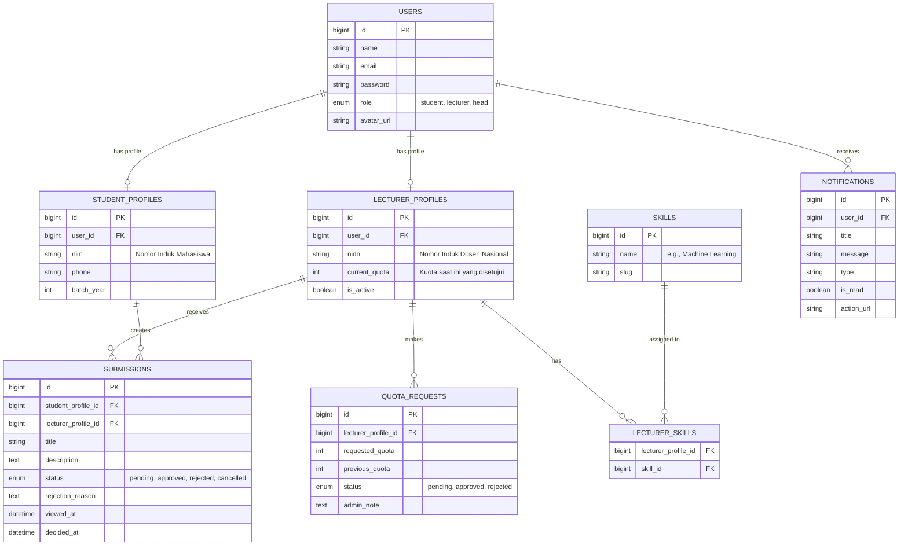

# Database Schema Design - SI Pengajuan Dosen

Dokumen ini menjelaskan rancangan Entity Relationship Diagram (ERD) dan struktur database secara detail untuk Sistem Informasi Pengajuan Dosen. Rancangan ini mencakup semua fitur yang dibutuhkan mulai dari autentikasi, manajemen kuota dosen, pencarian berdasarkan keahlian, hingga alur pengajuan judul skripsi/bimbingan.

## 1. High-Level Entity Relationship Diagram (ERD)

Berikut adalah visualisasi hubungan antar tabel menggunakan notasi Mermaid.

## 2. Detail Struktur Tabel

### A. Core & Authentication

#### 1. `users`

Tabel utama untuk autentikasi. Semua peran (Mahasiswa, Dosen, Kaprodi) masuk di sini.

| Column       | Type        | Description                   |
| ------------ | ----------- | ----------------------------- |
| `id`         | BIGINT (PK) | Auto increment ID             |
| `name`       | STRING      | Nama lengkap user             |
| `email`      | STRING      | Email unik untuk login        |
| `password`   | STRING      | Hash password                 |
| `role`       | ENUM        | `student`, `lecturer`, `head` |
| `avatar_url` | STRING      | Path foto profil (Opsional)   |
| `created_at` | TIMESTAMP   |                               |
| `updated_at` | TIMESTAMP   |                               |

### B. Profil Pengguna

#### 2. `student_profiles`

Menyimpan data spesifik mahasiswa. Terpisah dari tabel users agar tabel users tetap ringan.

| Column       | Type        | Description                               |
| ------------ | ----------- | ----------------------------------------- |
| `id`         | BIGINT (PK) |                                           |
| `user_id`    | BIGINT (FK) | Relasi ke tabel `users`                   |
| `nim`        | STRING      | Nomor Induk Mahasiswa (Unique)            |
| `phone`      | STRING      | Nomor HP/WA untuk kontak cepat (Opsional) |
| `batch_year` | INTEGER     | Tahun angkatan (e.g., 2021)               |
| `created_at` | TIMESTAMP   |                                           |
| `updated_at` | TIMESTAMP   |                                           |

#### 3. `lecturer_profiles`

Menyimpan data spesifik dosen, terutama kuota dan NIDN.

| Column          | Type        | Description                                                         |
| --------------- | ----------- | ------------------------------------------------------------------- |
| `id`            | BIGINT (PK) |                                                                     |
| `user_id`       | BIGINT (FK) | Relasi ke tabel `users`                                             |
| `nidn`          | STRING      | Nomor Induk Dosen Nasional (Unique)                                 |
| `current_quota` | INTEGER     | Jumlah maksimal mahasiswa yang boleh dibimbing (Default: 0 atau 10) |
| `is_active`     | BOOLEAN     | Status aktif dosen menerima bimbingan                               |
| `created_at`    | TIMESTAMP   |                                                                     |
| `updated_at`    | TIMESTAMP   |                                                                     |

### C. Keahlian & Pencarian (Feature: Lecturer Search)

#### 4. `skills`

Master data untuk keahlian/topik riset. Dibuat tabel terpisah agar mahasiswa bisa memfilter dosen berdasarkan tag yang konsisten.

| Column | Type        | Description                                  |
| ------ | ----------- | -------------------------------------------- |
| `id`   | BIGINT (PK) |                                              |
| `name` | STRING      | Nama Skill (e.g., "Data Science", "Web Dev") |
| `slug` | STRING      | Slug URL friendly (e.g., "data-science")     |

#### 5. `lecturer_skills` (Pivot Table)

Tabel penghubung Many-to-Many antara Dosen dan Skill.

| Column                | Type        | Description |
| --------------------- | ----------- | ----------- |
| `lecturer_profile_id` | BIGINT (FK) |             |
| `skill_id`            | BIGINT (FK) |             |

### D. Fitur Utama: Pengajuan & Bimbingan

#### 6. `submissions`

Inti dari aplikasi. Mencatat pengajuan judul dari mahasiswa ke dosen.

| Column                | Type        | Description                                            |
| --------------------- | ----------- | ------------------------------------------------------ |
| `id`                  | BIGINT (PK) |                                                        |
| `student_profile_id`  | BIGINT (FK) | Mahasiswa yang mengajukan                              |
| `lecturer_profile_id` | BIGINT (FK) | Dosen yang dituju                                      |
| `title`               | STRING      | Judul skripsi/penelitian yang diajukan                 |
| `description`         | TEXT        | Deskripsi singkat atau abstrak rencana penelitian      |
| `status`              | ENUM        | `pending`, `approved`, `rejected`, `cancelled`         |
| `rejection_reason`    | TEXT        | Alasan penolakan (Diisi jika status rejected)          |
| `viewed_at`           | TIMESTAMP   | Kapan dosen melihat pengajuan ini (untuk fitur "seen") |
| `decided_at`          | TIMESTAMP   | Kapan dosen menerima/menolak                           |
| `created_at`          | TIMESTAMP   | Tanggal pengajuan                                      |
| `updated_at`          | TIMESTAMP   |                                                        |

> **Business Logic Note:**
>
> -   Jika status berubah menjadi `approved`, sistem harus mengecek apakah sisa kuota dosen masih cukup.
> -   Jika `approved`, jumlah kuota terpakai dosen bertambah (secara logika aplikasi).

### E. Manajemen Kuota (Feature: Head Dashboard & Approval)

#### 7. `quota_requests`

Log permintaan penambahan kuota oleh dosen yang harus disetujui Kaprodi (Head).

| Column                | Type        | Description                             |
| --------------------- | ----------- | --------------------------------------- |
| `id`                  | BIGINT (PK) |                                         |
| `lecturer_profile_id` | BIGINT (FK) | Dosen yang meminta                      |
| `requested_quota`     | INTEGER     | Jumlah total kuota baru yang diinginkan |
| `previous_quota`      | INTEGER     | Kuota sebelum request (history)         |
| `status`              | ENUM        | `pending`, `approved`, `rejected`       |
| `admin_note`          | TEXT        | Catatan dari Kaprodi (Opsional)         |
| `created_at`          | TIMESTAMP   |                                         |
| `updated_at`          | TIMESTAMP   |                                         |

### F. Pendukung

#### 8. `notifications`

Untuk menyimpan notifikasi agar persisten (tidak hilang saat refresh browser).

| Column       | Type        | Description                        |
| ------------ | ----------- | ---------------------------------- |
| `id`         | BIGINT (PK) |                                    |
| `user_id`    | BIGINT (FK) | Penerima notifikasi                |
| `title`      | STRING      | Judul notifikasi                   |
| `message`    | TEXT        | Isi pesan                          |
| `type`       | STRING      | e.g., `info`, `success`, `warning` |
| `is_read`    | BOOLEAN     | Penanda sudah dibaca               |
| `action_url` | STRING      | Link jika notifikasi diklik        |
| `created_at` | TIMESTAMP   |                                    |

---

## 3. Catatan Implementasi & Relasi

1.  **Polymorphism vs Strict Tables:**
    Saya memilih menggunakan tabel profil terpisah (`student_profiles`, `lecturer_profiles`) daripada Polymorphic Relationship di tabel `users` karena atribut kedua role ini sangat berbeda. Ini membuat query lebih cepat dan struktur database lebih bersih (Clean Architecture).

2.  **Logic Kuota Dosen:**

    -   **Total Kuota:** Diambil dari field `lecturer_profiles.current_quota`.
    -   **Kuota Terisi:** Dihitung dengan query `count(submissions)` where `lecturer_id = X` AND `status = 'approved'`.
    -   **Sisa Kuota:** `current_quota` - `Kuota Terisi`.
    -   Tidak perlu menyimpan kolom `filled_quota` di tabel dosen untuk menghindari inkonsistensi data (race condition), lebih baik dihitung _on-the-fly_ atau di-cache.

3.  **Unique Constraints:**
    -   Satu mahasiswa sebaiknya hanya boleh memiliki **satu** pengajuan dengan status `pending` atau `approved` dalam satu waktu untuk mencegah spam ke banyak dosen sekaligus. (Perlu divalidasi di level aplikasi/backend code).
